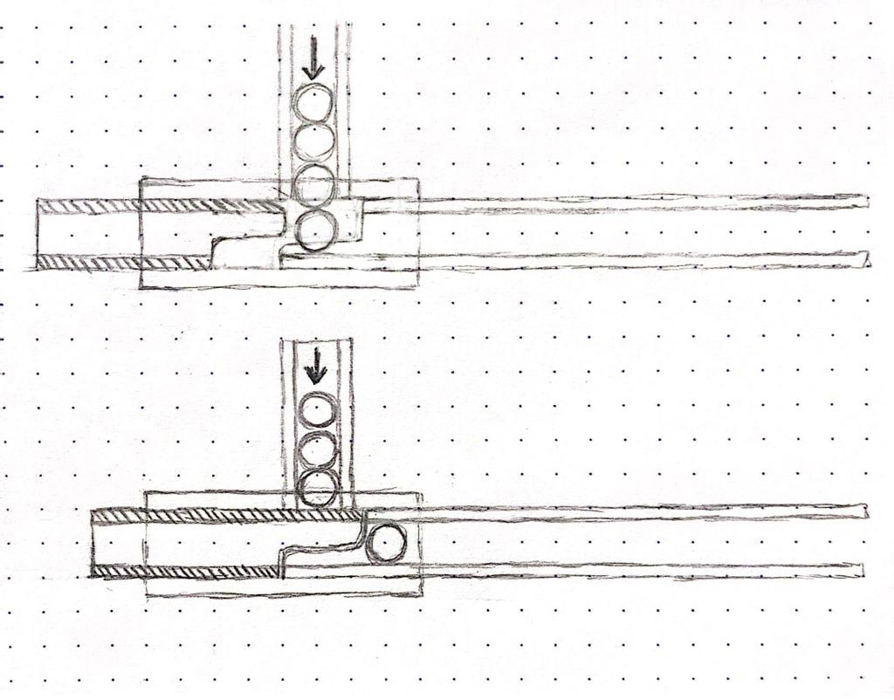
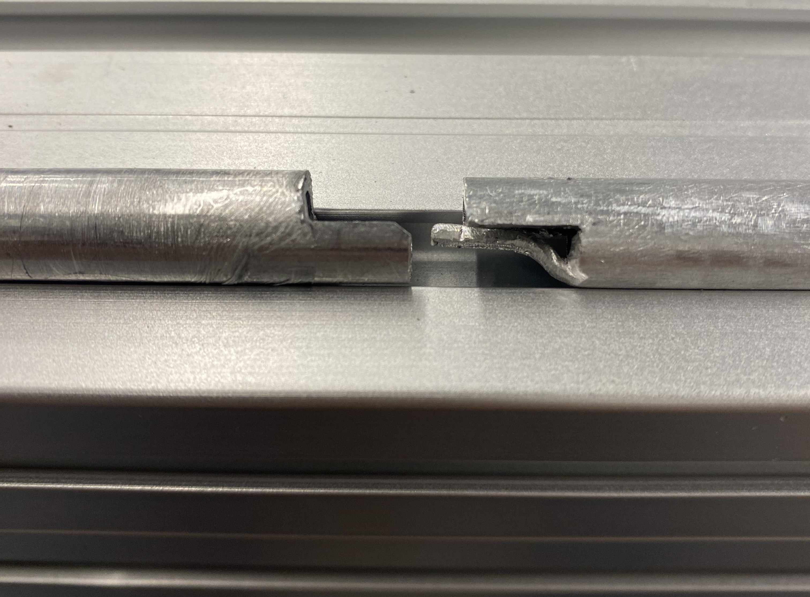
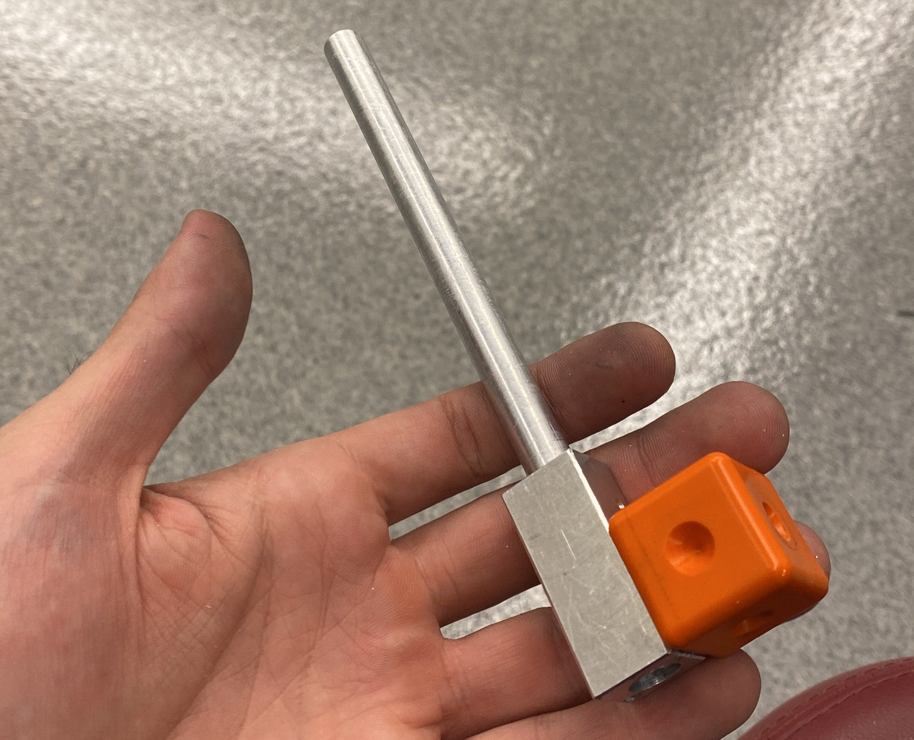
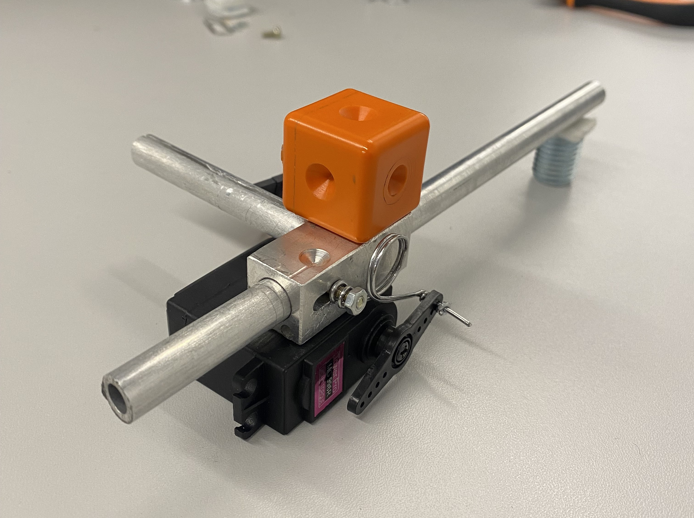
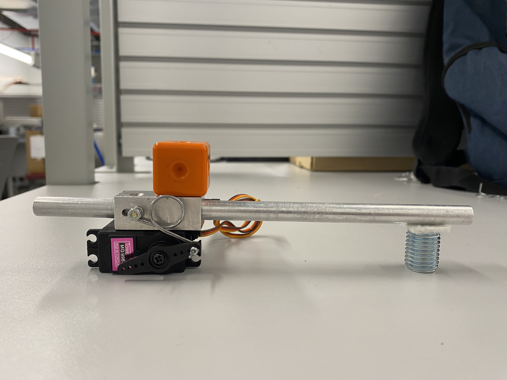

# Kuka-target-tracking
Is an automatic system for tracking of moving targets, aiming and pneumatic firing. 

 

# **1. Preparation of the environment: PC communicating with KUKA**
 

### Environments referenced thoughout this doocument:
- Client: your pc, any computer
- Windows KUKA: Windows running on Kuka's PC (KR C4 controller), that can be acceced by the smartpad
- HMI KUKA: the software / HMI that appears on the smartpad when you turn on the kuka, it is simply an application running on KUKA Windows, 'it is possible to minimize it and keep the windows 7 screen on the smart pad (in settings)

 

### Kuka basics to follow the next steps

  
Terms

    KRC: kuka robot controller
    
    KSV: Kuka system variables
    
    KRL: Kuka robot language
    
    KVP: kuka var proxy (servidor de variaveis em python)
    
    OSV: open show var (cliente de variaveis em python)
    
    .scr: arquivo do kuka em KRL
    
    .dat arquivo do kuka de variaveis

  
Modes of operation

  
    There are 4 robot operating modes, selected with the key on top of the smartpad
    
    - T1: mode for manual control (6D mouse buttons) with reduced speed (max 250mm/s)
    - T2: Mode for manual control (6D mouse buttons) of high speed (programmed speed)
    - EXT: Automatic mode
    - AUTO: Automatic mode with external control (PLC)

    

  
Permissions

  
    The actions allowed on the smartpad are determined by the type of operator that is logged into the system. 
    
    There are 4 types of operator: operator, expert, administrator and ……… 
    
    Some actions are only allowed for an operator logged in as an expert, such as some settings, actions in code (such as creating empty lines (Enter)), viewing and editing .dat files, … 
    
    To select the operator: Settings → operator …. 
    
    Enter the password (default is kuka)

    

  
Bypass door sensors

  
    The door sensors have 2 internal relays activated by magnets, to activate them it is necessary that both relays are activated simultaneously. Simultaneous activation is guaranteed by the structure of the hinged and sliding doors, if you touch the magnetized part of the sensor to the part with the relays, they will be activated simultaneously, and the “safety stop” error will appear on the smartpad. To get rid of the error 'it is necessary: 
    
    1. Put in mode (T1) 
    2. Log in as an expert 
    3. Remove the mobile part of the sensor (on the door) apart from the fixed part (on the cage)
    4. Open a random file
    5. Click on: Settings (KUKA button) > Commissioning > Service > Reset safety I/O errors (I used the smartpad in Portuguese, so the names os the configs may differ)
    6. Approach the two parts of the sensor aligned (simulating the movement of the door) 
    7. Glue the two parts of the sensor so that there is no absolute movement between the two parts 
    8. Close the file 
    
    A red warning “Conf. safe equipment CIB SR Safety Module ", which when given All OK the error "Operator safety not confirmed" appears, which to solve just press the Quitt button
    
    NOTE: It will probably be necessary to repeat steps 4, 5 and 6 alternately to resolve the issue. “Operator security not confirmed” would just press the Quitt button on the robot

    

  
KUKA interfaces

  
    - ON/OFF Button
    - Emergency button
    - Quitt button: To ensure the operator is safe, you may be asked to press it after you open a safety door
    - Smartpad

    
 
 

# Basic communication for utilities (to facilitate for the next steps)

### **Allow communication between the Client and the robot: protocol and identification (IP)**

At HMI Kuka
1. Configure a fixed IP on the KUKA HMI (in my case I configured it as 10.103.16.242)
2. Add a NAT port for 5900 tcp/udp in KUKA (by smartpad)
3. Cold start the kuka (restart)
no customer
1. Configure fixed PI in the same subnet (in my case I configured it as 10.103.16.248)
2. Connect the ethernet cable between the client and the KUKA CPU (the kuka has an RJ-45 output from both the PC and the PLC)
3. Test the connection with ping in the terminal: ping <kuka ip>

 

### **Communication interface between the Client and the robot: VNC**

VNC is a remote sharing system, if you install a server on Windows Kuka and a Viewer on the Client, you will access the windows KUKA screen on the Client, and consequently the HMI kuka
No Windows KUKA

1. [Install Ultra VNC version 1.6.4 x86 on KUKA](https://uvnc.com/downloads/ultravnc.html)
2. Configure vnc (in kuka's Smatpad) 1. Run the uVNC server 
    1. Open the settings (right click on the icon in the windows taskbar on the right)
    2. Uncheck RDP mode option
    3. Create a password (kuka1)
3. Create a server shortcut and add it to the setup file for automatic startup on start
        
    

     
On the client (windows)

  
        1. Install Ultra VNC version 1.6.4 x64 on PC 
        2. Run VNC 1. Click on the server shortcut or run the .exe file
            a. Put the ip with the port (10.103.16.242:5900) 
            b. Enter the password (kuka1) 
            c.  When a blue prompt opens → click on the screen with the mouse, type the letter “b” (to select option B) and press enter
          
    

  
    

    
One the client (linux)

  
        1. Download ONLY the TigerVNC viewer on linux (the command line on the website has the server and the viwer, delete the server part before running) 
                
            TigerVNC:  https://www.cyberciti.biz/faq/install-and-configure-tigervnc-server-on-ubuntu-18-04/
            
        2. Run the executable to install
        3. Open the app 
            a. Put the ip 
            b. Enter the password (kuka1)
    

        
        
    

 

### **File sharing between the Client and the robot**

This part aims to allow the Client to access and have full control over a folder in Windows KUKA and IHM Kuka, so you can send files directly from your PC to the kuka without having to use a pendrive, like software that will have to be installed later or .scr and .dat files from the robot's own programs. This process involves sharing Disk D of kuka with another user of the same machine (Windows Kuka), created just for this function.
On Windows KUKA

1. Create a new user with administrator permissions (in my case, name: Share ; password: share)
2. Allow disk sharing for this new User with the KUKA DATA disk (D)
3. Give permission (full control) to “Users”, just to be able to do the next step of creating the shared folder
4. Inside disk D, create a folder to be shared, you will only edit this folder
5. Now that the folder has already been created, remove permission from disk D for Users (so you don't do shit changing some file you shouldn't)
6. Give full permissions to “users” only for the previously created shared folder → NOTE: a copy of this folder will appear on the first file level, along with disk D and other files, you will edit this copy, inside disk D you won't be able to edit anything else, because I took permission

On the Client

1. Put \\<kuka's ip> in the file path to access kuka's D disk
2. Enter login and password: log in with the User mentioned above (Share)

 

# Servers and Clients communication

    
 

    

### **Kuka variables server (Kukavarproxy)**

KukavarProxy is a TCP/IP server that listens on port 7000 on Kuka, reads and writes variables (angle, position, speed, …) on Kuka's KRC system
On the Kuka HMI
1. Add NAT port 7000 for tcp/udp
2. Cold start the kuka (restart) 

On the Client
1. [Download the github repository](https://github.com/ImtsSrl/KUKAVARPROXY)
2. Pass the folder to Windows Kuka → play in the shared folder, for example, or pass by USB stick 

On theWindows Kuka
1. Install: Run the executable: KUKAVARPROXY-master/src/KukavarProxy.exe
2. Run a command in CMD to register 2 files in the windows registry (there is a command in git itself)
3. Create a shortcut for the executable and add it to the setup file, for automatic initialization at start (the same was done with VNC)

 

### **Windows kuka variables client (PC → windows kuka) (OpenShowVar) in python**

KukaVarRPoxy client (cross-platform communication interface) that allows reading and sending variables to KukaVarProxy
Requirement: The KukaVarPRoxy server must be running on Windows KUKA
NOTE: There is one of these in java too, JOpenShowVar
in python
1. [Install the pyhton library py_openshowvar](https://github.com/linuxsand/py_openshowvar)

    It basically talks to KukavarProxy, allowing the reading and writing of robot variables

2. The IP and port (10.103.16.242 and 7000) go in the pyhton code (it has test files in git)

 

### **The python code to communicate with kuka**

The data type that is exchanged between OSV and KVP is string. It is possible to read and write 2 types of variables, global variables (variables created in a .dat file and used in any .scr code) and environment variables. With environment variables it is possible to read speed, acceleration, TCP position, joint angles... , and in most of them it is possible to write values too, changing the robot CONFIGURATION (not the robot state, as position → environment variables DO NOT the robot to move, movement requires a move command executed in KRL in a file running on the robot) With global variables the functionality is defined by code. In the case of communication with a VxWroks client, to control movement for example, a position variable is needed, which can contain information on joint angles or TCP coordinates in x, y, z according to the type of variable that the move command this setting to receive. It is also possible to control the type of movement (PTP, LIN, CIRC, ….) it is possible to use a switch case in which each case is a type of movement for example.

 

### **VxWorks variable client (Windows kuka → VxWorks) in KRL**

Kuka .scr code that runs in a loop and updates values received from a server (PC for example) to the robot, for example, coordinates or angles for the robot to follow. In the case of the RoboDK program, there is a specific file of them that works as a client. This type of code (which runs in a loop) must be run in AUT (automatic) mode continuously.

 

# **2. Python software**

 

# **3. Electronic Circuit**

 

# **4. Pneumatic Circuit**

 

# **5. Weapon**

    
     
    

    
    

 

# **6. Results**

[Demonstation recording](https://www.youtube.com/shorts/xiI2wgIckmc)
